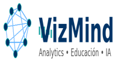

# 🧠 VizMind – Portafolio de Análisis de Datos  

### by **Jehimy Borda P.**  
Analista de Datos & Finanzas | Business Intelligence | Docente Universitaria | IA Aplicada

Bienvenido/a a mi portafolio **VizMind**, un espacio donde comparto proyectos de **Power BI, Python, SQL, análisis financiero, automatización de procesos, visualización de datos e inteligencia artificial aplicada**.  
Integro experiencia en los sectores salud, educativo y financiero con herramientas de análisis para optimizar procesos, fortalecer la toma de decisiones y enseñar pensamiento analítico a estudiantes y servidores públicos.

---

## 🧩 Enfoque profesional
Mi trabajo combina cuatro pilares:

### 🔹 **1. Analítica de datos**
- Limpieza, transformación y modelamiento de datos  
- ETL en Python  
- Consultas SQL para análisis operativo y financiero  
- Visualización interactiva con Power BI  

### 🔹 **2. Inteligencia de Negocio (BI)**
- Diseño de dashboards ejecutivos  
- Creación de KPIs financieros y de salud  
- Herramientas para toma de decisiones basadas en datos  
- Automatización de reportes y procesos repetitivos  

### 🔹 **3. Docencia universitaria e institucional**
- Diseño de módulos en finanzas y gestión  
- Docente de cursos de Power BI e IA Aplicada para entidades públicas (DANE, Superintendencia de Servicios Públicos Domiciliarios), a través de la Universidad Nacional de Colombia  
- Enseñanza práctica orientada a casos reales  
- Uso de datos abiertos en clases  
- Formación de estudiantes y servidores públicos en pensamiento crítico y analítico  

### 🔹 **4. Inteligencia Artificial Aplicada**
- Formación en IA aplicada para el sector público  
- Automatización de procesos con herramientas de IA  
- Integración de modelos analíticos en la toma de decisiones  

---

## 🛠️ Herramientas y tecnologías
**Power BI · SQL · Python · R · Excel avanzado · Modelos financieros · ETL · Inteligencia Artificial · Sistemas contables (Alegra, Sigo, World Office)**

---

## 📁 Proyectos incluidos en este portafolio  
*(Se irán cargando progresivamente con documentación técnica)*  
- 📊 **Dashboard financiero para pymes**  
- 🤖 **Automatización de nómina con Python**  
- 🧬 **Segmentación de población en salud**  
- 📈 **Análisis de cartera y facturación**  
- 🧹 **ETL – Limpieza y transformación de datos en Python**  
- 📘 **Clases y guías de enseñanza basadas en datos**  
- 🏛️ **Material de formación: Power BI e IA Aplicada para servidores públicos (DANE / Superservicios)**  

---

## 🎓 Formación académica
- **Maestría en Inteligencia de Negocio – UNIR (2024)**  
  Modelamiento de datos, analítica, BI y visualización.  

---

## 💼 Experiencia relevante
*(Versión técnica resumida para portafolio; la versión completa está en tu HV y LinkedIn)*  

### **Docente – Cursos Institucionales (2026 – Actual)**  
A través de la Universidad Nacional de Colombia: Analítica y Visualización de Datos con Power BI e Inteligencia Artificial Aplicada para Servidores Públicos, dictados para el DANE y la Superintendencia de Servicios Públicos Domiciliarios.

### **Docente universitaria – Universidad El Bosque**  
Enseño finanzas y gestión con enfoque analítico y práctico, integrando datasets reales y ejercicios aplicados.

### **Analista de Talento Humano y Finanzas – Borda & Jiménez**  
Automatización de procesos, manejo de datos financieros, facturación electrónica, reportes y análisis contable.

### **Coordinadora de Servicios Médicos – Servinsalud IPS**  
Creación de bases de datos, optimización de procesos, análisis poblacional y mejora de indicadores de salud y facturación.

---

## 📞 Contacto profesional  
📧 vizmind.ia@gmail.com / vizmind.ia@outlook.com  
🔗 LinkedIn: https://www.linkedin.com/in/jehimy-patriciajp  
🔗 GitHub: https://github.com/vizmind-portfolio/vizmind-portfolio  

---

## © VizMind – Portafolio con marca personal  
*(Contenido público, pero protegido mediante diseño de marca.)*
